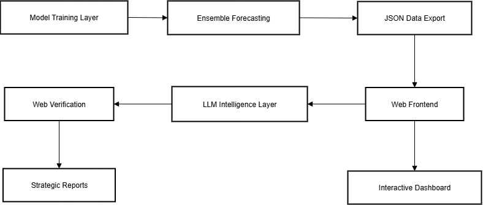

# 🚀 TrendAI: Next-Generation YouTube Beauty Trend Prediction Engine


**Stop chasing trends. Start predicting them.**

TrendAI isn't just another analytics dashboard—it's a sophisticated AI ecosystem that combines **traditional model training** with **advanced LLM validation** to dissect the YouTube beauty landscape with surgical precision, identify emerging micro-trends before they explode, and **forecast their trajectory up to 12 months into the future**.

While others analyze what happened yesterday, TrendAI uses dual-layer AI intelligence to tell you what's happening tomorrow.

## 🔥 What Makes TrendAI Revolutionary

### 🧠 **Dual-Layer AI Architecture**

* **Model Training Layer**: SBERT-powered topic discovery, FAISS-accelerated clustering, and ensemble forecasting
* **Advanced LLM Layer**: Gemini 2.5 Pro for real-time web verification, trend validation, and strategic intelligence generation
* **Cross-Validation System**: LLM validates and enhances traditional model predictions with current market reality

### 🌐 **Web-Integrated Intelligence Dashboard**

* **Interactive Leaderboards**: Real-time trend rankings with growth trajectory analysis
* **Dynamic Forecasting Graphs**: Multi-horizon predictions with confidence intervals
* **LLM-Powered Reports**: Strategic insights validated against live web data
* **Admin Control Panel**: Model management and configuration interface

### 🎯 **Multi-Dimensional Trend Scoring**

Our proprietary `WeightedTrendScore™` algorithm intelligently balances:

```
🎬 Video Performance (60%): Views, likes, engagement velocity
💬 Community Sentiment (25%): Comment volume, emotional intensity  
🏷️ Tag Intelligence (15%): Hashtag momentum, cross-platform relevance
```

### 🔮 **Enterprise-Grade Forecasting**

**Three AI models, one unified prediction, LLM-validated:**

1. **🧠 LSTM/GRU Networks**: Captures complex behavioral patterns and viral dynamics
2. **📊 ARIMA Statistical Models**: Identifies trend momentum and seasonal cycles
3. **⚡ Facebook Prophet**: Handles growth curves and sudden trend shifts
4. **🤖 Gemini 2.5 Pro**: Real-time validation and competitive intelligence

## 🚀 **TrendAI Web Application Architecture**



**The Complete Intelligence Pipeline:**

1. **🔄 Model Training**: Python-based AI models process YouTube data
2. **📊 Forecast Generation**: Ensemble predictions with confidence metrics
3. **📤 Data Export**: JSON export for web application consumption
4. **🌐 Web Interface**: React-based dashboard with interactive components
5. **🤖 LLM Integration**: Gemini 2.5 Pro validates and enhances predictions
6. **🔍 Web Verification**: Real-time trend validation across platforms
7. **📋 Strategic Intelligence**: Actionable business reports for decision-makers

## 🛠️ **Deployment Options**

### 🎯 **Option 1: Complete Web Application (Recommended)**

**Backend Setup:**

```bash
cd foldername/backend
pip install -r requirements.txt
python main.py
```

**Frontend Setup:**

```bash
# Open new terminal
cd foldername/frontend
npm install
npm run dev
```

**Access your dashboard at:** `http://localhost:3000`

### ⚡ **Option 2: Python Model Training Only**

**Jupyter Notebook:**

```bash
git clone <repository-url>
cd foldername/notebook
jupyter notebook TrendAI.ipynb
```

**Modular Python:**

```bash
pip install -r requirements.txt
python run.py
```

## 📊 **Web Application Features**

### 🏆 **Interactive Leaderboards**

* **Monthly Trend Rankings**: Top 10/25 trending topics with growth predictions
* **Ranking Change Indicators**: Visual arrows showing trend momentum shifts
* **Tag Performance**: Real-time hashtag popularity tracking
* **Video Integration**: Trending content with embedded player

### 📈 **Dynamic Forecasting Dashboard**

* **Multi-Horizon Charts**: 20-100 day predictions with interactive controls
* **Trend Comparison**: Multiple topic performance visualization
* **Growth Trajectory Analysis**: Emerging vs. established vs. declining trends
* **Confidence Intervals**: Prediction reliability metrics

### 🤖 **LLM Intelligence Reports**

* **Strategic Analysis**: AI-powered business intelligence reports
* **Competitive Intelligence**: Market positioning and competitor analysis
* **Web-Verified Insights**: Real-time validation against social media platforms
* **Actionable Recommendations**: Specific next steps for content creators and brands

### ⚙️ **Admin Control Panel**

* **Model Configuration**: Weight factor adjustments and parameter tuning
* **Dataset Management**: Upload and process new training data
* **Performance Monitoring**: Model accuracy and prediction confidence tracking
* **System Status**: Real-time health monitoring and diagnostics

## 🚀 **Quick Start Guide**

### Web Application Setup:

1. **Clone Repository**

```bash
git clone <repository-url>
cd foldername
```

2. **Backend Setup**

```bash
cd backend
pip install -r requirements.txt
python main.py
```

3. **Frontend Setup** (New Terminal)

```bash
cd frontend
npm install
npm run dev
```

4. **Access Dashboard**

```
http://localhost:3000
```

### Python-Only Usage:

```python
from enhanced_trend_ai import EnhancedGenerationalTrendAI
from data_exporter import TrendDataExporter

# Initialize prediction engine
predictor = EnhancedGenerationalTrendAI()

# Load YouTube data
comment_files = ['comments1.csv', 'comments2.csv', ...]
video_file = 'videos.csv'

# Execute analysis pipeline
results = predictor.run_multi_horizon_analysis(
    comment_files, video_file,
    forecast_horizons=[20, 30, 60, 90, 120]
)

# Export for web application
exporter = TrendDataExporter(predictor)
web_data = exporter.export_complete_analysis(
    output_file='web_dashboard_data.json',
    months_ahead=12
)
```

## 🎯 **Strategic Applications**

### 📺 **Content Creators**

* **Web Dashboard**: Visual trend identification with LLM-validated opportunities
* **Timing Intelligence**: Optimal posting windows based on predictive analytics
* **Competitive Analysis**: AI-powered insights into successful content strategies

### 🏢 **Beauty Brands**

* **Strategic Reports**: LLM-generated market intelligence with web verification
* **Campaign Planning**: Precision timing recommendations for maximum impact
* **Innovation Pipeline**: Trend-driven product development opportunities

### 📊 **Marketing Agencies**

* **Client Dashboards**: Interactive presentations with real-time data
* **Competitive Intelligence**: AI-powered market positioning analysis
* **ROI Optimization**: Data-driven budget allocation recommendations

## 🔬 **Advanced Intelligence Features**

### 🎭 **Generational Language AI**

* **Pattern Recognition**: Gen Z, Millennial, Gen X, and Boomer language detection
* **Cross-Demographic Analysis**: Content appeal across age groups
* **Cultural Adaptation**: Regional and demographic customization

### 🏷️ **Tag Momentum Prediction**

* **Real-Time Tracking**: Hashtag velocity monitoring
* **Cross-Platform Analysis**: Tag migration patterns across social networks
* **Viral Prediction**: Hashtag breakout forecasting

### 🌐 **LLM Web Verification**

* **Real-Time Validation**: Live social media trend confirmation
* **Competitive Monitoring**: Brand engagement tracking across platforms
* **Authenticity Scoring**: AI-powered trend verification system

## ⚡ **Technical Architecture**

**Frontend Stack:**

* React with TypeScript
* Tailwind CSS for responsive design
* Recharts for interactive visualizations
* Real-time API integration

**Backend Stack:**

* Python FastAPI server
* TensorFlow/PyTorch model serving
* JSON data processing pipeline
* RESTful API endpoints

**AI Integration:**

* Google Gemini 2.5 Pro API
* Web search integration
* Real-time trend validation
* Competitive intelligence gathering

## 🔮 **The Future of TrendAI**

**Roadmap 2025:**

* Real-time YouTube API integration
* Multi-platform analysis (TikTok, Instagram, Twitter)
* Advanced A/B testing framework
* White-label dashboard solutions
* Mobile application development

## 🚀 **Get Started Today**

**Web Application:**

```bash
# Backend
cd foldername/backend && python main.py

# Frontend (new terminal)
cd foldername/frontend && npm run dev

# Access: http://localhost:3000
```

**Python Development:**

```bash
git clone <repository-url>
cd foldername
pip install -r requirements.txt
python run.py
```

**Join the future of trend prediction. While others react to what happened, you'll be creating what happens next with AI-powered intelligence and LLM-validated insights.**

---

*TrendAI: Where model training meets advanced LLMs for unparalleled trend intelligence.*


